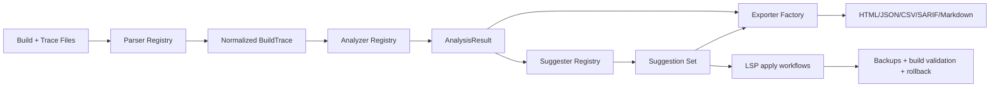
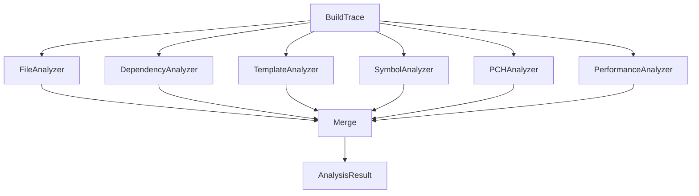
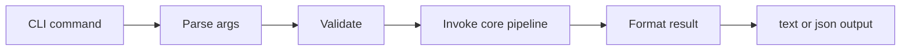
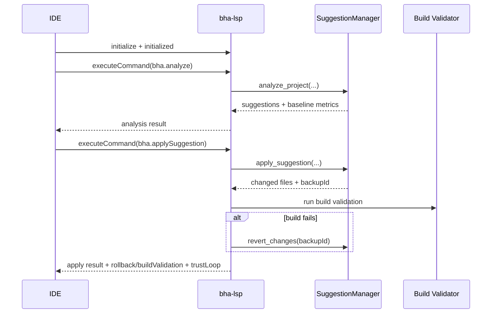

# Architecture

## 1. System Overview

Build Hotspot Analyzer (BHA) is a layered C++20 system that turns raw compiler/build telemetry into optimization actions with optional safe application flows.

Core responsibilities:
- parse heterogeneous trace formats
- run normalized analysis across compilation units
- generate suggestions with confidence, rationale, and estimated savings
- optionally apply edits with backup, rebuild validation, and rollback
- export outputs for developers, CI, and code-scanning systems

## 2. Codebase Component Map

- Core types: `headers/bha/types.hpp`
- Parsers: `headers/bha/parsers/*`, `sources/bha/parsers/*`
- Analyzers: `headers/bha/analyzers/*`, `sources/bha/analyzers/*`
- Suggesters: `headers/bha/suggestions/*`, `sources/bha/suggestions/*`
- Exporters: `headers/bha/exporters/exporter.hpp`, `sources/bha/exporters/exporter.cpp`
- Build adapters: `headers/bha/build_systems/adapter.hpp`, `sources/bha/build_systems/adapter.cpp`
- Snapshot storage + compare: `headers/bha/storage.hpp`, `sources/bha/storage/storage.cpp`
- CLI surface: `cli/*`
- LSP surface: `lsp/headers/*`, `lsp/sources/*`
- Optional semantic refactor tool: `tools/refactor/*`

## 3. Type System and Contracts

### 3.1 Primary domain objects

- `BuildTrace` aggregates `CompilationUnit` objects and build metadata.
- `CompilationUnit` carries includes, templates, command line, and timing breakdown.
- `AnalysisResult` aggregates analyzer outputs:
  - file performance
  - dependency/header impact
  - template hotspots
  - symbol metrics
  - cache/distribution suitability metrics
- `Suggestion` carries:
  - type/priority/confidence
  - target file location
  - estimated savings
  - implementation guidance
  - caveats/verification
  - optional `TextEdit[]`
  - application mode metadata

### 3.2 Application mode semantics

- `advisory`: insight only, no trusted automated edit path.
- `direct-edits`: concrete `TextEdit` payload exists and can be applied directly.
- `external-refactor`: refactor is delegated to specialized tooling flow.

## 4. Parsing Layer

Registry and parsers are initialized in `cli/main.cpp` via:
- `register_all_parsers()`

Supported parser families:
- Clang time-trace JSON
- GCC timing text/report forms
- MSVC timing output
- Intel classic/oneAPI variants
- NVCC timing output

Parser responsibilities:
- detect parse capability by path/content
- normalize format-specific fields into common types
- preserve command line context for downstream analysis/suggestions

## 5. Analyzer Layer

Registry initialized via:
- `register_all_analyzers()`

Execution entrypoint:
- `analyzers::run_full_analysis(...)`

Behavior:
- iterates all analyzers
- merges partial outputs into single `AnalysisResult`
- supports global and per-analyzer time limits
- tolerates analyzer failure/timeout by continuing with available results

## 6. Suggestion Layer

Registry initialized via:
- `register_all_suggesters()`

Suggester catalog and descriptor APIs:
- list available suggesters
- describe input requirements
- run targeted suggester by ID or suggestion type alias

Available suggestion families:
- pch
- forward-decl
- include-removal
- move-to-cpp
- template-instantiation
- unity-build
- header-split
- pimpl

Design details:
- each suggester reads normalized analysis + build trace + heuristics config
- confidence and safety signals are attached at generation time
- explainability is attached through `hotspot_origins` (include chains/template origin)
- consolidation pipeline can merge/normalize overlapping recommendations

## 7. Build Adapter Layer

Build adapters abstract system-specific configure/build/clean behavior.

Supported adapters:
- cmake
- ninja
- make
- msbuild
- meson
- bazel
- buck2
- scons
- xcode
- unreal

Responsibilities:
- detect best adapter via confidence scoring
- configure trace flags and memory flags per compiler
- capture logs and trace artifacts
- expose compile command database path when available

## 8. CLI Architecture

The CLI command model is registry-based:
- command class per verb (`analyze`, `suggest`, `apply`, `build`, `record`, `export`, `snapshot`, `compare`)
- common argument parsing/validation contracts
- consistent JSON/text output modes

## 9. LSP Architecture

`bha-lsp` is an optional module (`BHA_ENABLE_LSP=ON`) that wraps analysis/apply flows in a JSON-RPC LSP surface.

Key elements:
- server state machine: `Uninitialized -> Initializing -> Running -> ShuttingDown`
- command dispatch via `workspace/executeCommand`
- suggestion manager cache + backup lifecycle
- rebuild validation and rollback policies
- trust-loop persistence (`predicted` vs `actual` savings)

## 10. Safety and Failure Model

Safety controls:
- deterministic text edit ranges
- backup before mutation
- optional rebuild validation
- rollback on failed validation
- safe-only filtering and mode-aware auto-applicability checks

Failure handling:
- parser/analyzer/suggester stages are isolated where possible
- benchmark harnesses persist errors and reasons (`applyErrors`, logs, summary files)
- LSP returns diagnostics-rich payloads rather than silent failures

## 11. Export Architecture

Exporter factory supports:
- JSON
- HTML
- CSV
- SARIF
- Markdown

Additional output surfaces:
- GitHub PR annotations
- GitLab code-quality annotations

Export layer also serializes:
- cache/distribution suitability metrics
- explainability payloads where available
- application mode metadata

## 12. Comparison and Regression Gates

Snapshot subsystem stores build analysis snapshots and computes deltas.

Category gates:
- translation units
- headers
- templates

CLI compare exit behavior:
- non-zero when significant overall regression or category gate failure is detected

## 13. Real-Repo Validation Architecture

BHA includes repeatable validation infrastructure for well-known open-source repos:
- clone matrix: `tests/clone_repos.sh`
- build matrix: `tests/build_repos.sh`
- LSP apply benchmark runner: `tests/run_repo_apply_benchmark.py`
- per-project LSP workflow runner: `lsp/tests/lsp_test_client.py`

Validation artifacts:
- `tests/cli/benchmarks/<timestamp>/results.json`
- `tests/cli/benchmarks/<timestamp>/summary.json`
- `tests/cli/benchmarks/<timestamp>/summary.md`
- `tests/cli/benchmarks/<timestamp>/logs/*`
- `tests/cli/benchmarks/<timestamp>/suggestion_edits/*`

For methodology and concrete recorded runs, see `repo_validation.md`.

## 14. Extension Points

To extend BHA safely:
- new parser: implement `ITraceParser` and register
- new analyzer: implement `IAnalyzer` and register
- new suggester: implement `ISuggester` and register + descriptor coverage
- new exporter: implement `IExporter` + factory registration
- new adapter: implement `IBuildSystemAdapter` + registry registration

Recommended for all new components:
- unit tests for positive/negative paths
- explicit timeout behavior tests
- benchmark harness validation on at least one non-trivial external repo

